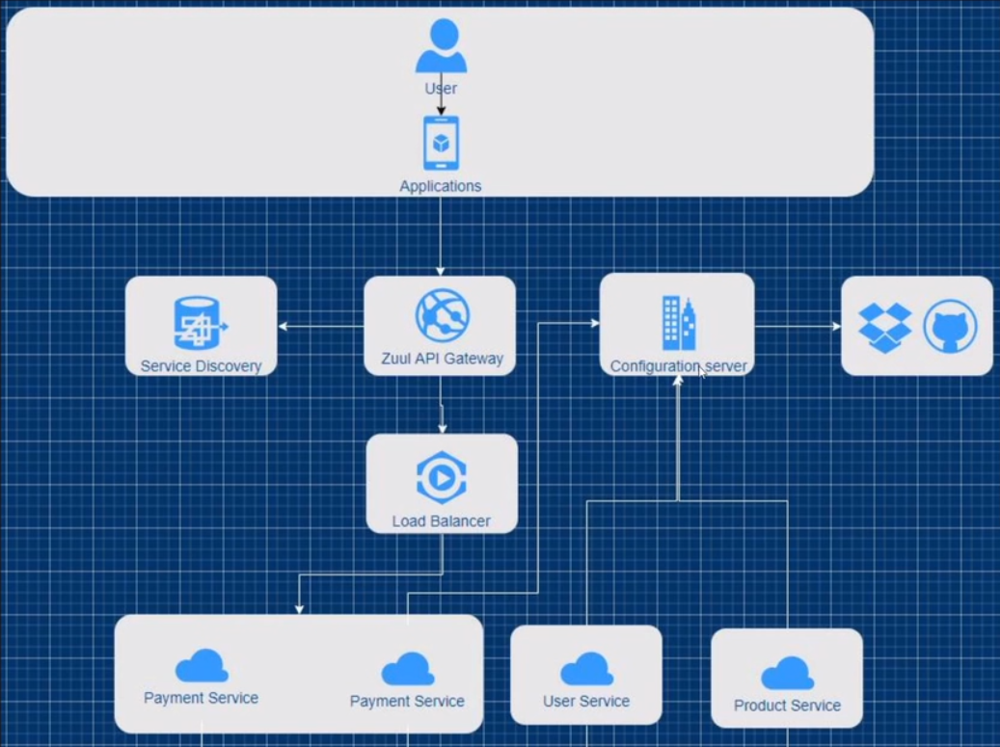
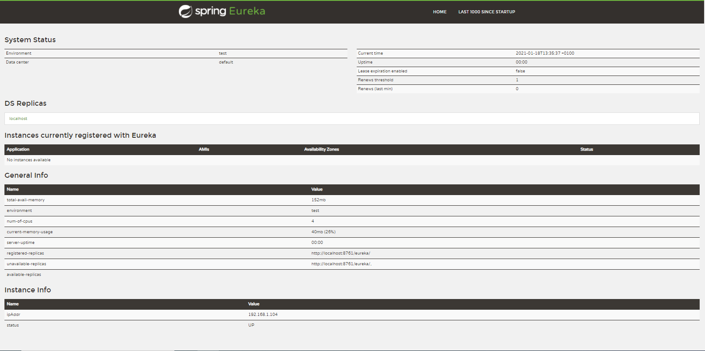
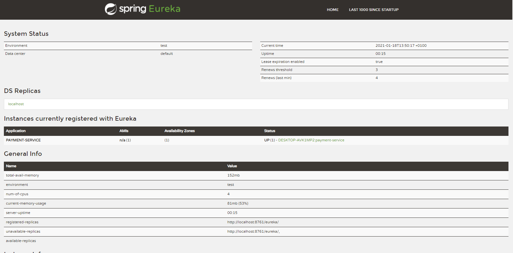
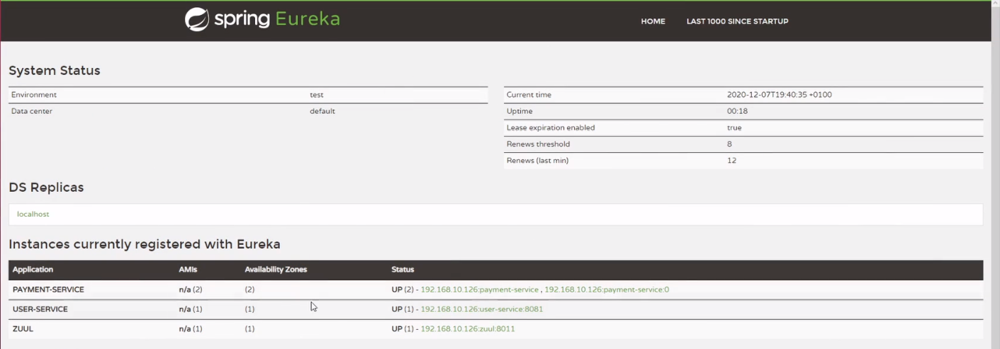
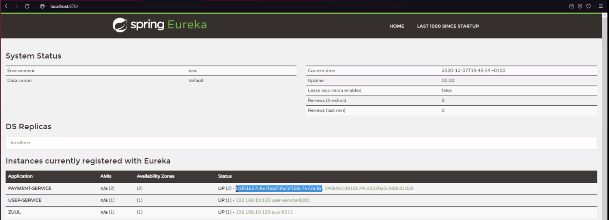

# microservicesArchitecture_using_SpringCloud

The main goal of the project was to create a multi-module test project compliant with the principles of microservice architecture:

The first thing was to configure the Service Directory, which was used to listen to services:

Test microservices have been connected to Service Discovery and the result of this action is below:

The next step was to run the same code for several instances, so that the Zuul Api Gateway with the help of Load Balancer could direct the network traffic.

The name of modules using the same code has been changed for better readability.

The last step was to create a global configuration that is an intermediary between the website and an external source e.g. Github, DropBox.

